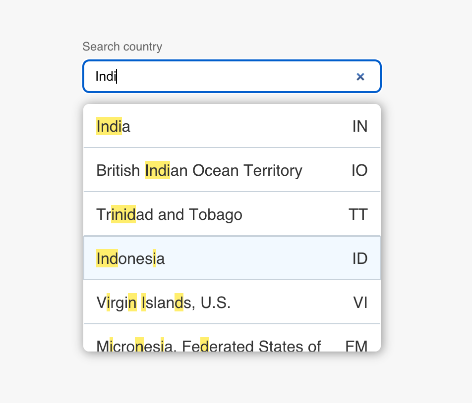
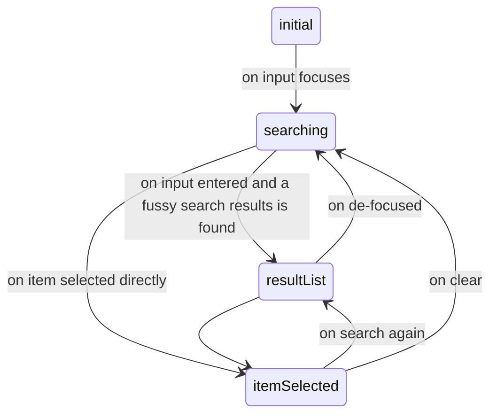

# Search List Input

Use case: An input component that can search and select an item from the list of provided data (in this a case a list of countries).

## [Demo](https://noushad-pp.github.io/search-list-input)



## Design Decisions

The logic has been kept separately from the application code not to pollute the business logic with the application layers. I used [x-state](https://xstate.js.org/docs/) a javascript library that helps to implement finite state machines
which suits the case as the input component logic can be represented as a sequential steps/states and the system will not be in two states at the same time. The system transitions from one state to another by reacting to the events happening inside the application.
This also eliminates the need for a state management library like redux which might bring lack of transparency to the code as the developer have to navigate through different places (actions / reducers etc) to understand the flow. In this case, the stateMachine representation depicts which states the app has and transitions
to different states and corresponding actions to run and with extra checks using guards.
This also helps to write tests easier.

Application is built using [Create React App](https://create-react-app.dev/) under the hood and leverages strict type checking advantages of [typescript](https://www.typescriptlang.org/)
Tests/linters/tsc checks are run with github actions and is deployed to github pages.

It can be represented as below:



##### Folder structure

```
search-list-input
│
│───README.md
│───tsconfig.json
│───package.json
│───eslint.json
│
│───application // contains application (react related code)
│   │───scss
│   │   └───var, mixin, colors etc
│   │
│   │───components
│   │   │───HighlightedText // highligh the occurences of matches
│   │   │───Input // Input field -> contiains keyboard event bindings
│   │   │───ResultList // List of search results
│   │   └───ResultItem
│   │
│   └─── SearchListInput // Container that binds all components
│
└───domain // business logic
    │───data
    │   └─── countries.json
    │
    └───search-list-input
        │───search-list-input.state.machine.ts // state machine defintion
        │───search-list-input.dto.ts // type defintions
        │───search-list-input.actions.ts // actions that  are executed on transitions/events which sets the internal states
        │───search-list-input.events.ts // events that trigger transitions
        └───search-list-input.constants.ts // configs
```

### Data source

The list of countries (name and ISO code) is copied from [this repo](https://gist.github.com/keeguon/2310008). The data is stored as json inside the repository.

### Fussy search

Whenever the use search for a country, we have to match it with the available list of countries and their code. I used a library called [fuzzysort](https://github.com/farzher/fuzzysort) inorder to do this as the scope of fussy search and match alogrithm is too big for the time I had. (It has good stars on github / active development and good issue trackings)

There were other libraries also available like [fusejs](https://fusejs.io/) but an advantage this library has is that it also return the matching indexes which I can use to highlight.

> NB: the country list was already sorted and the fuzzysort return best match in descending order based on the match score so there wasn't anything to do to sort the results.
> It has to be done if external data sources are allowed at some point

## How to run

#### pre-requisites

-   yarn or npm installed
-   node v14 or above

#### setup

-   `git clone git@github.com:noushad-pp/search-list-input.git`
-   `yarn install` or just `yarn`. You can also use npm but you can leverage the yarn.lock file that I have already committed when using yarn
-   `yarn start`

This will spin up a dev server at [http://localhost:3000](http://localhost:3000)

## TODO/ Future Plans

-   Testability: I intended to develop this in a TDD pattern but time constraint refrained me from doing it. So most important thing to do is cover atleast the logic part completely with tests.
-   Configurability:
    -   Even though it's implemented with countries search, I built it in mind with any kind of list. So extending it with pluggable data sources (user defined structure/ asynchronous data fetching etc.) is the next thing I would do.
    -   I didn't use any UI design libraries. I defined some spacing and other variables in sass var file but would also move some colors etc to vars file. Also, should be able to accept user values from a config file just like the data source
-   Deliver-ability: Package it and make it an installable library where other users can plug and play in to their forms/code with extendability in terms of UI
-   More features: Preview data filled on mouse hover (Major challenge is input field has to be focused during both keyboard and mouse focusings and since its a scrollable window, the position of the currently selected item has to be made into the current viewport and having a hover focusable item will complicate this procedure)
-   Aesthetics: Find a data source with flag info too.
